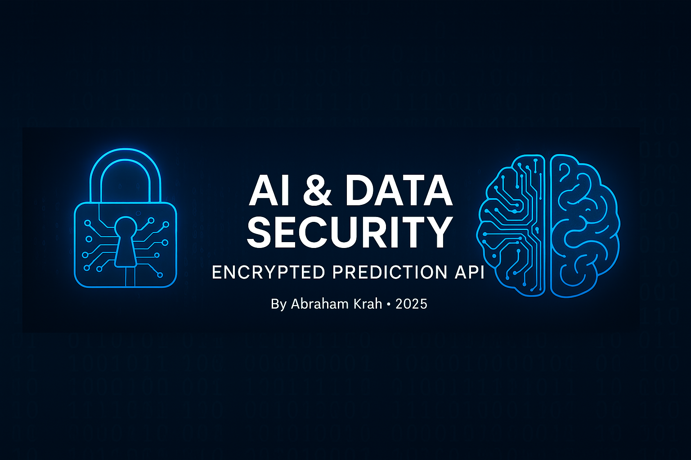

<p align="center">
  
</p>

<h1 align="center">🔐 AI & Data Security – End-to-End Encrypted Prediction API</h1>

<p align="center">
  
  
  
  
  
  
</p>

---

This project implements a complete pipeline combining **data encryption**, **machine learning**, and **secure API deployment**.

---

## 📁 Project Structure

```bash
tp_cybersecurity_ai/
├── data/                         # Source data and encryption key
│   ├── Student_Performance.csv
│   ├── Student_Performance_encrypted.csv
│   └── file_key.key
│
├── model/                        # Trained model
│   └── linear_model.pkl
│
├── api/                          # Flask API code
│   ├── app.py
│   └── secrets.py
│
├── client/                       # Client-side test script
│   └── client_test.py
│
├── prepare_data.py              # Data preparation and model training
├── requirements.txt             # Python dependencies
└── README.md
```

---

## ✅ Workflow Summary

### 🧪 Part 1: Data Preparation

- Generate a **Fernet encryption key**
- Encrypt the `Student_Performance.csv` dataset
- Decrypt the dataset for training
- Select input features: `Hours Studied`, `Previous Scores`
- Target variable: `Performance Index`
- Train a **linear regression model**
- Save the model using `joblib`

### 🔌 Part 2: Flask API

- Local Flask API running at `http://127.0.0.1:5000`
- `/predict` endpoint:
  - Receives encrypted input
  - Validates `x-api-key` header
  - Returns model prediction
- Optionally expose the API via `ngrok` for public access

### 🔐 Part 3: Security Features

| Security Layer         | Implemented | Description                                                |
|------------------------|-------------|------------------------------------------------------------|
| 🔐 Data Encryption      | ✅           | Client encrypts input using `Fernet`                       |
| 🗝️ API Key Auth         | ✅           | API validates a secure `x-api-key` header                  |
| 🔒 SHA-256 Hash Check   | ✅           | Server compares **hashed** API key for validation          |

---

## 🚀 How to Use

### 1. Prepare the Data & Train the Model

```bash
python3 prepare_data.py
```

### 2. Run the Flask API

```bash
python3 -m tp_cybersecurity_ai.api.app
```

API accessible at: `http://127.0.0.1:5000`

### 3. Test with Encrypted Client Request

```bash
python3 tp_cybersecurity_ai/client/client_test.py
```

---

## 🌐 Expose API with Ngrok

```bash
ngrok http 5000
```

Use the generated URL (e.g. `https://xxxxx.ngrok-free.app/predict`) inside `client_test.py` to test secure requests from the outside.

---

## 📦 Dependencies

```txt
flask
joblib
cryptography
requests
scikit-learn
```

Install with:

```bash
pip install -r requirements.txt
```

---

## 👨‍💻 Author

**Abraham Krah**  
Data & AI Security Project – 2025

